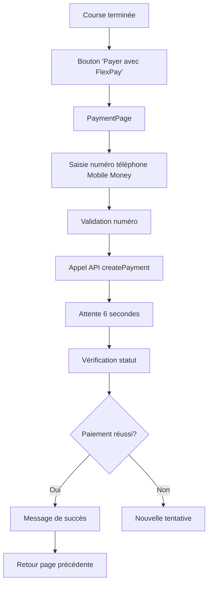

# Documentation d'Intégration FlexPay - Bita Express

## Vue d'ensemble

Cette documentation détaille l'intégration du système de paiement FlexPay dans l'application mobile Bita Express. FlexPay permet aux passagers de payer leurs courses terminées via Mobile Money ou cartes bancaires.

## Fonctionnalités

### 1. Paiement Mobile Money
- Support des opérateurs: Vodacom, Airtel, Orange, Tigo
- Validation automatique du numéro (format: 243xxxxxxxxx)
- Détection automatique de l'opérateur

### 2. Gestion des Devises
- Support CDF (Franc Congolais) et USD (Dollar Américain)
- Conversion automatique des montants
- Taux de change configurables

## Architecture Technique

### API FlexPay
**Base URL:** `https://backend.flexpay.cd/api/rest/v1/`

#### Endpoints utilisés:
1. **POST `/paymentService`** - Initier un paiement
2. **GET `/check/{orderNumber}`** - Vérifier le statut d'un paiement

### Structure des données

#### PaymentModel
```dart
class PaymentModel {
  final int? id;
  final int courseId;        // ID de la course
  final String devise;       // CDF ou USD
  final double montant;      // Montant à payer
  final String moyen;        // Type de paiement
  final String statut;       // Statut du paiement
  final String dateCreation;
  final String? orderNumber; // Numéro de commande FlexPay
  final Map<String, dynamic>? transactionData;
}
```

## Interface Utilisateur

### PaymentPage
Page complète de paiement avec les sections suivantes:

1. **Détails de la course**
   - Informations du trajet
   - Montant à payer
   - Devise sélectionnable

2. **Sélection du mode de paiement**
   - Mobile Money uniquement (type=1)

3. **Formulaire de paiement**
   - Champs dynamiques selon le mode choisi
   - Validation en temps réel

4. **Processus de paiement**
   - Indicateur de progression
   - Vérification automatique du statut
   - Messages d'erreur/succès

### Intégration dans PassengerRidesPage
- Bouton "Payer avec FlexPay" pour les courses terminées
- Navigation vers PaymentPage
- Rafraîchissement automatique après paiement réussi

## Workflow de Paiement



## Validation des Données

### Numéro de téléphone (Mobile Money)
- Format requis: `243xxxxxxxxx` (12 chiffres)
- Préfixes supportés:
  - Vodacom: 81, 82, 84, 85
  - Airtel: 89, 97, 98, 99
  - Orange: 90, 91
  - Tigo: 80

### Montants
- Minimum: 100 CDF ou équivalent
- Maximum: 1,000,000 CDF ou équivalent
- Conversion automatique USD/CDF

## Configuration

### Variables d'environnement
```dart
// Dans config.dart ou api.dart
static const String FLEXPAY_BASE_URL = 'https://backend.flexpay.cd/api/rest/v1/';
static const String FLEXPAY_MERCHANT = 'votre_merchant_id';
static const String FLEXPAY_PASSWORD = 'votre_password';
```

### Taux de change
```dart
// Taux configurables (à mettre à jour régulièrement)
static const double USD_TO_CDF_RATE = 2500.0;
```

## Méthodes API Principales

### 1. createPayment()
```dart
Future<PaymentModel?> createPayment({
  required int courseId,
  required double montant,
  required String devise,
  required String moyen,
  String? numeroTelephone,
  String? numeroCompte,
})
```

### 2. checkPaymentStatus()
```dart
Future<PaymentModel?> checkPaymentStatus(String orderNumber)
```

### 3. processFlexPayPayment()
```dart
Future<PaymentModel?> processFlexPayPayment({
  required RideModel ride,
  required int paymentType,
  required String currency,
  String? phoneNumber,
  String? accountNumber,
})
```

## Gestion d'Erreurs

### Codes d'erreur FlexPay
- `0`: Succès
- `1`: Erreur générale
- `2`: Paramètres invalides
- `3`: Solde insuffisant
- `4`: Transaction refusée

### Messages utilisateur
- Validation des champs en temps réel
- Messages d'erreur contextuels
- Indicateurs de chargement
- Timeout après 30 secondes

## Tests

### Tests unitaires
- Validation des modèles de données
- Logique de conversion de devises
- Détection d'opérateur téléphonique

### Tests d'intégration
- Interface utilisateur PaymentPage
- Navigation entre pages
- Processus de paiement complet

### Tests à effectuer
```bash
flutter test test/flexpay_integration_test.dart
```

## Sécurité

### Bonnes pratiques
1. **Validation côté client**: Validation des données avant envoi
2. **Timeout**: Limite de 30 secondes par transaction
3. **Retry logic**: Maximum 3 tentatives par paiement
4. **Logs sécurisés**: Pas d'informations sensibles dans les logs

### Données sensibles
- Numéros de téléphone chiffrés en transit
- Informations de carte non stockées localement
- Tokens de session avec expiration

## Déploiement

### Prérequis
1. Compte marchand FlexPay actif
2. Credentials API configurés
3. Tests de validation effectués

### Environnements
- **Développement**: Sandbox FlexPay
- **Production**: API FlexPay live

## Maintenance

### Monitoring
- Suivi des taux de succès des paiements
- Logs des erreurs FlexPay
- Performance des appels API

### Mises à jour
- Taux de change hebdomadaires
- Validation périodique des credentials
- Tests de régression mensuels

## Support

### Debugging
1. Vérifier les logs de l'API
2. Tester avec différents numéros/montants
3. Valider la connectivité réseau

### Contact FlexPay
- Documentation: https://flexpay.cd/docs
- Support: support@flexpay.cd

---

*Documentation mise à jour le: 2024-01-15*
*Version: 1.0.0*
